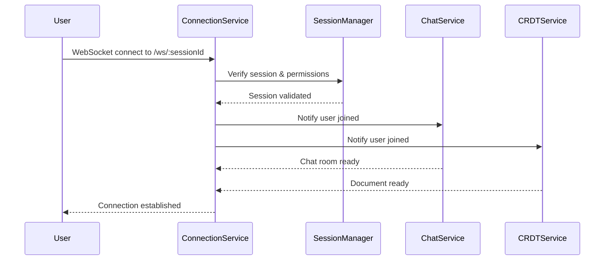
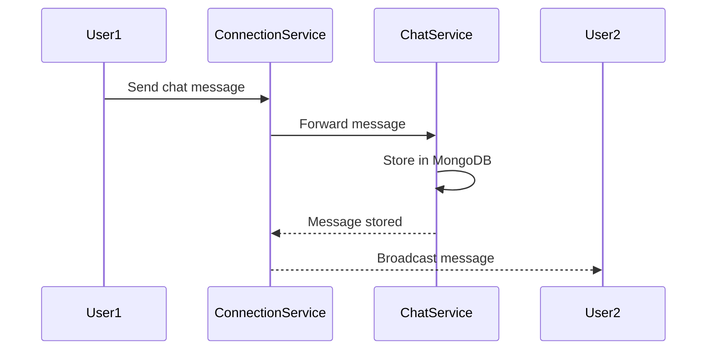
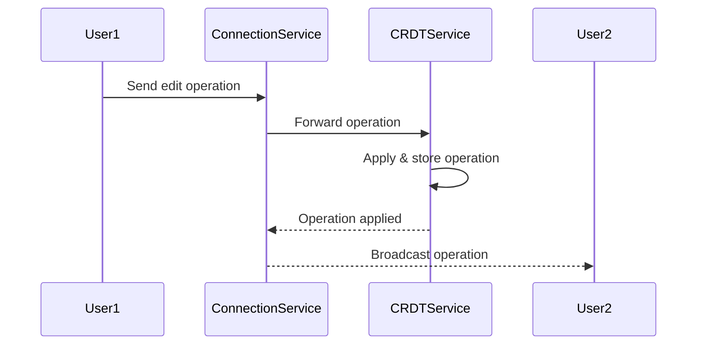

# Cloud Code Editor - Database Architecture

## Overview
This document outlines the database architecture for the Cloud Code Editor microservices system.

## Database Separation Strategy

### 1. ChatService - MongoDB (`chat_service_db`)
- **Purpose**: Store chat messages and real-time communication data
- **Database Type**: MongoDB (Document-based)
- **Reason**: High-frequency read/write operations for messages, flexible schema for different message types

#### Collections:
```javascript
// chat_messages
{
  _id: ObjectId,
  message_id: String (UUID),
  session_id: String,
  user_id: String,
  username: String,
  content: String,
  message_type: "TEXT" | "CODE_SNIPPET" | "FILE_SHARE" | "SYSTEM_MESSAGE" | "EMOJI_REACTION",
  reply_to_message_id: String,
  is_edited: Boolean,
  is_deleted: Boolean,
  created_at: Date,
  updated_at: Date,
  metadata: Object
}

// chat_rooms
{
  _id: ObjectId,
  room_id: String (UUID),
  session_id: String (unique),
  room_name: String,
  description: String,
  is_active: Boolean,
  max_participants: Number,
  current_participants: Number,
  created_at: Date,
  last_activity: Date,
  settings: Object
}

// chat_participants
{
  _id: ObjectId,
  participant_id: String (UUID),
  room_id: String,
  session_id: String,
  user_id: String,
  username: String,
  email: String,
  role: "MODERATOR" | "PARTICIPANT" | "OBSERVER",
  is_online: Boolean,
  is_typing: Boolean,
  joined_at: Date,
  last_seen: Date,
  last_message_read_id: String
}
```

### 2. ConnectionService - MongoDB (`connection_service_db`)
- **Purpose**: Manage WebSocket connections and service communications
- **Database Type**: MongoDB (Document-based)
- **Reason**: Need to store complex connection metadata and communication logs

#### Collections:
```javascript
// session_connections
{
  _id: ObjectId,
  connection_id: String (UUID),
  session_id: String,
  user_id: String,
  username: String,
  websocket_session_id: String,
  status: "CONNECTED" | "DISCONNECTED" | "RECONNECTING" | "IDLE",
  services_connected: Array["CHAT", "CRDT", "VOICE", "SCREEN_SHARE"],
  permissions: Object,
  client_info: Object,
  connected_at: Date,
  last_activity: Date,
  last_heartbeat: Date
}

// service_communications
{
  _id: ObjectId,
  communication_id: String (UUID),
  session_id: String,
  source_service: String,
  target_service: String,
  message_type: "CHAT_MESSAGE" | "CRDT_OPERATION" | "USER_JOIN" | "USER_LEAVE" | "PERMISSION_UPDATE" | "HEARTBEAT" | "ERROR_NOTIFICATION",
  message_content: Object,
  status: "PENDING" | "PROCESSING" | "COMPLETED" | "FAILED" | "RETRY",
  created_at: Date,
  processed_at: Date,
  retry_count: Number
}
```

### 3. CRDT Service - MongoDB (`crdt_service_db`)
- **Purpose**: Store collaborative document operations and state
- **Database Type**: MongoDB (Document-based)
- **Reason**: CRDT operations need flexible schema, version history tracking

#### Collections:
```javascript
// crdt_documents
{
  _id: ObjectId,
  document_id: String (UUID),
  session_id: String,
  title: String,
  language: String,
  content: String,
  version: Number,
  created_by: String,
  created_at: Date,
  updated_at: Date,
  is_active: Boolean,
  metadata: Object
}

// crdt_operations
{
  _id: ObjectId,
  operation_id: String (UUID),
  document_id: String,
  session_id: String,
  user_id: String,
  operation_type: "INSERT" | "DELETE" | "RETAIN" | "FORMAT",
  position: Number,
  length: Number,
  content: String,
  timestamp: Date,
  vector_clock: Object,
  applied: Boolean,
  conflicts: Array
}

// document_snapshots
{
  _id: ObjectId,
  snapshot_id: String (UUID),
  document_id: String,
  session_id: String,
  content: String,
  version: Number,
  operation_count: Number,
  created_at: Date,
  created_by: String
}
```

### 4. SessionManager - PostgreSQL (Existing)
- **Purpose**: Session management, user authentication, permissions
- **Database Type**: PostgreSQL (Relational)
- **Reason**: ACID properties needed for authentication and authorization

#### Tables (Existing):
```sql
-- sessions table
CREATE TABLE sessions (
    session_id UUID PRIMARY KEY,
    creator_id UUID NOT NULL,
    session_name VARCHAR(255) NOT NULL,
    description TEXT,
    language VARCHAR(50),
    is_active BOOLEAN DEFAULT TRUE,
    max_participants INTEGER DEFAULT 10,
    created_at TIMESTAMP DEFAULT CURRENT_TIMESTAMP,
    expires_at TIMESTAMP,
    settings JSONB
);

-- Additional tables as defined in existing schema...
```

## Service Communication Flow

### 1. User Joins Session (`/:sessionId`)


### 2. Chat Message Flow


### 3. CRDT Operation Flow


## Database Connection Configuration

### MongoDB Connections
```yaml
# ChatService
spring.data.mongodb.uri=mongodb://localhost:27017/chat_service_db

# ConnectionService  
spring.data.mongodb.uri=mongodb://localhost:27017/connection_service_db

# CRDTService
spring.data.mongodb.uri=mongodb://localhost:27017/crdt_service_db
```

### PostgreSQL Connection (SessionManager)
```yaml
spring.datasource.url=jdbc:postgresql://localhost:5432/cloud_code_editor
spring.datasource.username=postgres
spring.datasource.password=password
```

## Indexing Strategy

### MongoDB Indexes
```javascript
// ChatService indexes
db.chat_messages.createIndex({ "session_id": 1, "created_at": 1 })
db.chat_messages.createIndex({ "session_id": 1, "is_deleted": 1 })
db.chat_rooms.createIndex({ "session_id": 1 }, { unique: true })
db.chat_participants.createIndex({ "session_id": 1, "user_id": 1 }, { unique: true })

// ConnectionService indexes
db.session_connections.createIndex({ "session_id": 1, "user_id": 1 }, { unique: true })
db.session_connections.createIndex({ "websocket_session_id": 1 }, { unique: true })
db.service_communications.createIndex({ "session_id": 1, "created_at": 1 })

// CRDTService indexes
db.crdt_documents.createIndex({ "session_id": 1 }, { unique: true })
db.crdt_operations.createIndex({ "document_id": 1, "timestamp": 1 })
db.crdt_operations.createIndex({ "session_id": 1, "timestamp": 1 })
```

## Backup and Scaling Strategy

### MongoDB Clusters
- **Replica Sets**: For high availability
- **Sharding**: For horizontal scaling based on session_id
- **Backup**: Daily automated backups

### PostgreSQL
- **Master-Slave**: For read replicas
- **WAL**: For point-in-time recovery
- **Backup**: Continuous WAL archiving
